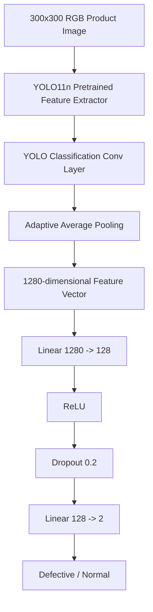
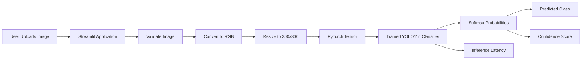

# Industrial Visual Defect Detection System

A production-oriented computer vision solution for classifying manufactured casting products as **Defective** or **Normal** from product images.

The project includes the full training notebook, a trained PyTorch model, and a Streamlit application for interactive inference.

## Live Demo

**Streamlit App:**  
https://industrial-defect-detection-project-hhd9euspypkpc7bxxg5pid.streamlit.app/

Upload a casting image to receive:

- Predicted class: **Defective** or **Normal**
- Confidence score
- Inference latency
- Device used for inference

---

## 1. Problem Statement

Manual visual inspection of manufacturing defects is repetitive, time-consuming, and subject to human inconsistency. The objective of this project is to automate the first stage of visual quality inspection by classifying a product image into one of two classes:

- **Defective**
- **Normal**

This is formulated as an **image classification** problem rather than an object-detection problem because the available dataset provides image-level labels and does not contain defect bounding-box annotations.

---

## 2. Project Structure

```text
defect-detection-project/
│
├── app.py
├── complete_defect_classifier.pth
├── Training.ipynb
├── requirements.txt
└── README.md
```

### Files

- `Training.ipynb` — complete data preparation, training, evaluation, model saving, architecture visualization, and error-analysis workflow.
- `complete_defect_classifier.pth` — complete trained PyTorch model used directly for inference.
- `app.py` — Streamlit application for interactive prediction.
- `requirements.txt` — runtime dependencies.
- `README.md` — project documentation.

---

## 3. Dataset Strategy

The dataset contains casting-product images organized into two classes:

```text
def_front  -> Defective
ok_front   -> Normal
```

The original dataset already contained separate training and testing folders.

### Original Data Distribution

| Split | Defective | Normal |
|---|---:|---:|
| Original training set | 3,758 | 2,875 |
| Test set | 453 | 262 |

The original training set was further divided into training and validation subsets using a reproducible 80/20 split with `random_state=42`.

### Final Split

| Split | Defective | Normal | Total |
|---|---:|---:|---:|
| Training | 3,006 | 2,300 | 5,306 |
| Validation | 752 | 575 | 1,327 |
| Test | 453 | 262 | 715 |

The test set was kept completely untouched during training and model selection.

---

## 4. Preprocessing and Data Augmentation

All images are resized to:

```text
300 x 300
```

The training pipeline applies mild augmentation to improve robustness without significantly altering defect morphology:

```python
transforms.Compose([
    transforms.Resize((300, 300)),
    transforms.RandomHorizontalFlip(p=0.5),
    transforms.RandomRotation(degrees=10),
    transforms.ColorJitter(
        brightness=0.1,
        contrast=0.1
    ),
    transforms.ToTensor()
])
```

Validation and test images use only:

```python
transforms.Compose([
    transforms.Resize((300, 300)),
    transforms.ToTensor()
])
```

Augmentation is deliberately conservative because aggressive geometric or photometric transformations could distort small surface defects and create unrealistic manufacturing images.

---

## 5. Handling Class Imbalance

The training data contains more defective samples than normal samples.

To prevent the model from becoming biased toward the majority class, inverse-frequency class weights were calculated:

```text
Defective weight: 0.8826
Normal weight:    1.1535
```

These weights were applied through weighted cross-entropy loss:

```python
nn.CrossEntropyLoss(weight=class_weights)
```

This increases the penalty for mistakes on the underrepresented normal class and produces a more balanced classifier.

---

## 6. Model Selection

### Candidate Approaches Considered

For this task, several practical model families could be considered:

1. **Custom CNN**
   - Simple and lightweight.
   - Easy to implement.
   - Less attractive because the dataset is relatively small and training from scratch may not generalize as well.

2. **Conventional ImageNet Transfer Learning Models**
   - Examples: ResNet, EfficientNet, MobileNet, Xception.
   - Strong classification baselines.
   - Mature and widely used.

3. **YOLO Classification Family**
   - Modern pretrained visual feature extractor.
   - Lightweight variants suitable for low-latency inference.
   - Supports transfer learning while retaining a compact architecture.
   - Particularly attractive for future manufacturing-system expansion because the YOLO ecosystem also supports detection and segmentation tasks.

### Selected Architecture: YOLO11n-cls

The project uses **YOLO11n-cls**, the nano classification variant of the YOLO11 family.

It was selected because:

- The problem is image-level classification, not localization.
- The `n` variant is compact and efficient.
- Pretrained visual features reduce the amount of task-specific training required.
- Its size makes it more suitable for production-line inference than a large backbone.
- It provides a practical accuracy/latency trade-off.
- The architecture can later be extended toward localized defect detection if bounding-box annotations become available.

---

## 7. Transfer Learning Strategy

The model starts from pretrained YOLO11n classification weights.

The pretrained feature-extraction network is frozen:

```python
for param in model.parameters():
    param.requires_grad = False
```

Only the final classifier is trained.

This approach was chosen because:

- The dataset is relatively small.
- Generic pretrained visual features are already useful.
- Freezing the backbone reduces overfitting risk.
- Training becomes significantly faster.
- Fewer parameters need to be optimized.

Only **164,226 parameters** are trainable after the classifier modification.

---

## 8. Classification Head Modification

The original YOLO11n-cls model contains a final classifier that maps 1,280 features to 1,000 ImageNet classes.

Original classifier:

```text
1280 -> 1000 classes
```

For this project, only this final classification layer was replaced.

Modified head:

```text
1280
  ↓
Linear(1280, 128)
  ↓
ReLU
  ↓
Dropout(0.2)
  ↓
Linear(128, 2)
  ↓
Defective / Normal
```

PyTorch implementation:

```python
model.model[-1].linear = nn.Sequential(
    nn.Linear(1280, 128),
    nn.ReLU(),
    nn.Dropout(0.2),
    nn.Linear(128, 2)
)
```

The YOLO feature-extraction architecture remains unchanged.

### Why This Modification?

The objective was not to redesign YOLO. Instead, a small task-specific head was introduced to:

- Adapt ImageNet features to binary industrial classification.
- Add a compact intermediate representation.
- Add dropout regularization.
- Keep the architecture simple and explainable.
- Preserve the efficiency of the pretrained YOLO11n backbone.

---

## 9. Training Configuration

| Parameter | Value |
|---|---|
| Framework | PyTorch |
| Base architecture | YOLO11n-cls |
| Input size | 300 x 300 |
| Batch size | 32 |
| Maximum epochs | 30 |
| Optimizer | Adam |
| Learning rate | 0.001 |
| Loss | Weighted Cross-Entropy |
| Backbone | Frozen |
| Trainable component | Modified classification head |
| Model selection | Lowest validation loss |
| Random seed | 42 |

The best checkpoint was saved whenever validation loss improved.

The lowest observed validation loss was approximately:

```text
0.0194
```

with validation accuracy of:

```text
99.40%
```

at epoch 29.

The best checkpoint was restored before test evaluation.

---

## 10. Model Innovation / Engineering Decisions

The innovation in this assessment is intentionally practical rather than architectural complexity for its own sake.

### 1. Minimal Head Adaptation

Instead of heavily modifying the pretrained architecture, only the classification head was changed. This preserves pretrained visual representations while making the network task-specific.

### 2. Lightweight Production-Oriented Backbone

YOLO11n-cls was selected to maintain strong classification performance while remaining small enough for practical CPU/GPU inference.

### 3. Conservative Augmentation

Surface defects can be subtle. Augmentation was therefore limited to small rotations, horizontal flips, and minor brightness/contrast variation rather than aggressive transformations that could alter defect appearance.

### 4. Weighted Training Objective

Class imbalance was handled directly in the loss function rather than artificially duplicating samples.

### 5. Separation of Training and Inference

The full trained model is exported after training. The Streamlit application does not retrain the network; it loads the trained model and performs inference only.

### 6. Production-Oriented Inference Output

The application provides not only the class label but also:

- Confidence score
- Inference latency
- Runtime device information

This makes the prototype more relevant to deployment and performance monitoring.

---

## 11. Evaluation Strategy

The final model was evaluated only on the untouched test set.

Metrics used:

- Accuracy
- Precision
- Recall
- F1-score
- Confusion matrix
- False-positive / false-negative inspection

### Overall Test Accuracy

```text
99.58%
```

### Classification Results

| Class | Precision | Recall | F1-score | Support |
|---|---:|---:|---:|---:|
| Defective | 0.9978 | 0.9956 | 0.9967 | 453 |
| Normal | 0.9924 | 0.9962 | 0.9943 | 262 |
| **Weighted Average** | **0.9958** | **0.9958** | **0.9958** | **715** |

### Confusion Matrix

```text
                    Predicted
                Defective   Normal
Actual Defective     451       2
Actual Normal          1     261
```

Only **3 of 715 test images** were misclassified.

---

## 12. False Positive / False Negative Analysis

Treating **Defective** as the positive class:

- **False Negatives: 2**
  - Two defective products were predicted as normal.
- **False Positives: 1**
  - One normal product was predicted as defective.

### Operational Interpretation

In a manufacturing environment, false negatives are generally more critical than false positives.

A false positive causes a normal item to be unnecessarily reviewed or rejected.

A false negative is more serious because a defective product may continue down the production line or reach a customer.

For this reason, **defective-class recall** is an important operational metric.

The model achieved defective recall of:

```text
99.56%
```

The training notebook also visually inspects all three misclassified test images to support basic failure analysis.

---

## 13. Architecture

### Model Architecture



### Inference Architecture



---

## 14. Trained Model

The repository includes:

```text
complete_defect_classifier.pth
```

This file contains the complete trained PyTorch model.

It was exported using:

```python
torch.save(
    model,
    "/content/complete_defect_classifier.pth"
)
```

This allows the inference application to load the trained model directly without rerunning training.

The full training process is also reproducible using:

```text
Training.ipynb
```

---

## 15. Setup Instructions

### Clone / Download the Project

Download the repository and open a terminal in the project directory.

### Optional: Create a Virtual Environment

```bash
python -m venv venv
```

Windows:

```bash
venv\Scripts\activate
```

Linux/macOS:

```bash
source venv/bin/activate
```

### Install Dependencies

```bash
pip install -r requirements.txt
```

---

## 16. Running the Application Locally

Run:

```bash
streamlit run app.py
```

Streamlit will provide a local browser address, normally:

```text
http://localhost:8501
```

Upload a JPG, JPEG, or PNG image and click **Analyze Image**.

The application returns:

```text
Predicted Class
Confidence Score
Inference Time
Device
```

---

## 17. Public Inference Application

A deployed Streamlit version is available at:

**https://industrial-defect-detection-project-hhd9euspypkpc7bxxg5pid.streamlit.app/**

The application performs inference using the trained model and returns the predicted class and confidence score.

> Note: the Streamlit interface is an interactive inference service. If a strict standalone REST API is required, the same `predict_image()` inference function can be exposed through a lightweight FastAPI endpoint without changing the model.

---

## 18. Inference Flow

```text
Uploaded Image
      ↓
Image Validation
      ↓
Convert to RGB
      ↓
Resize to 300 x 300
      ↓
Convert to Tensor
      ↓
YOLO11n Feature Extraction
      ↓
Modified Binary Classifier
      ↓
Softmax
      ↓
Prediction + Confidence
```

The model automatically uses CUDA when available; otherwise inference runs on CPU.

---

## 19. Error Handling and Logging

The inference application includes basic production-oriented safeguards:

- Missing-image validation
- Unsupported/corrupt-image handling
- Missing-model handling
- Model loading exception handling
- Inference exception handling
- Runtime logging
- Prediction logging
- Confidence logging
- Inference-latency measurement

The objective is to prevent malformed inputs from crashing the application and to make runtime behavior observable.

---

## 20. Known Limitations

### Dataset Scope

The model is trained on one casting-image dataset. Performance on different product types, cameras, lighting conditions, backgrounds, or manufacturing environments has not yet been validated.

### Classification Rather Than Localization

The system determines whether the complete product image is defective or normal. It does not identify the exact location or type of defect.

A future object-detection or segmentation model would be required for localized defect identification.

### Domain Shift

Changes in:

- camera position
- illumination
- image resolution
- production-line speed
- product material
- surface texture

may reduce performance.

### High Test Accuracy

The reported 99.58% accuracy is measured on the supplied dataset and should not automatically be interpreted as expected production accuracy.

A real deployment would require validation on images collected from the target production line.

### Confidence Calibration

Softmax confidence is useful for ranking prediction certainty but is not guaranteed to be perfectly calibrated. Production deployment could use temperature scaling or another calibration technique.

### Complete-Model Serialization

The deployed model is saved as a complete PyTorch object. This simplifies inference but makes loading more dependent on compatible PyTorch and Ultralytics versions.

For long-term production maintenance, a state-dictionary checkpoint, TorchScript, or ONNX export would provide more controlled portability.

---

## 21. Accuracy vs Latency Trade-off

YOLO11n-cls was deliberately chosen as the nano variant.

A larger classifier could potentially improve representation capacity but would increase:

- model size
- memory consumption
- inference latency
- hardware requirements

For production-line inspection, the best model is not necessarily the largest model. A compact model with high recall and low inference latency may provide greater operational value.

The current solution therefore prioritizes a strong balance between:

```text
Accuracy
+
Inference Speed
+
Model Size
+
Deployment Simplicity
```

---

## 22. Future Improvements

Potential extensions include:

- Fine-tuning selected backbone layers.
- Threshold tuning to prioritize defective recall.
- Confidence calibration.
- ONNX export for portable inference.
- Quantization for faster CPU deployment.
- Object detection for defect localization.
- Segmentation for defect-area measurement.
- More diverse production-line training images.
- Explainability methods such as Grad-CAM.
- Automated monitoring for data drift.
- REST API deployment for integration with manufacturing systems.

---

## 23. Reproducing Training

Training can be reproduced using:

```text
Training.ipynb
```

High-level sequence:

```text
Dataset Extraction
        ↓
Dataset Inspection
        ↓
80/20 Train-Validation Split
        ↓
Mild Data Augmentation
        ↓
Class Weight Calculation
        ↓
Load Pretrained YOLO11n-cls
        ↓
Freeze Backbone
        ↓
Replace Classification Head
        ↓
Train for 30 Epochs
        ↓
Save Best Validation Checkpoint
        ↓
Evaluate on Untouched Test Set
        ↓
Confusion Matrix / Precision / Recall / F1
        ↓
Error Analysis
        ↓
Export Complete Model
```

---

## 24. Technology Stack

- Python
- PyTorch
- Torchvision
- Ultralytics YOLO11
- Scikit-learn
- PIL
- Matplotlib
- Streamlit

---

## Summary

The system demonstrates an end-to-end computer vision workflow from dataset preparation through deployment:

```text
Dataset
   ↓
Preprocessing & Augmentation
   ↓
Transfer Learning
   ↓
Modified YOLO11n Classifier
   ↓
Class-Weighted Training
   ↓
Evaluation
   ↓
Error Analysis
   ↓
Model Export
   ↓
Interactive Streamlit Inference
```

The final model achieved **99.58% test accuracy**, with only **3 errors across 715 test images**, while retaining a lightweight architecture appropriate for practical inference.
